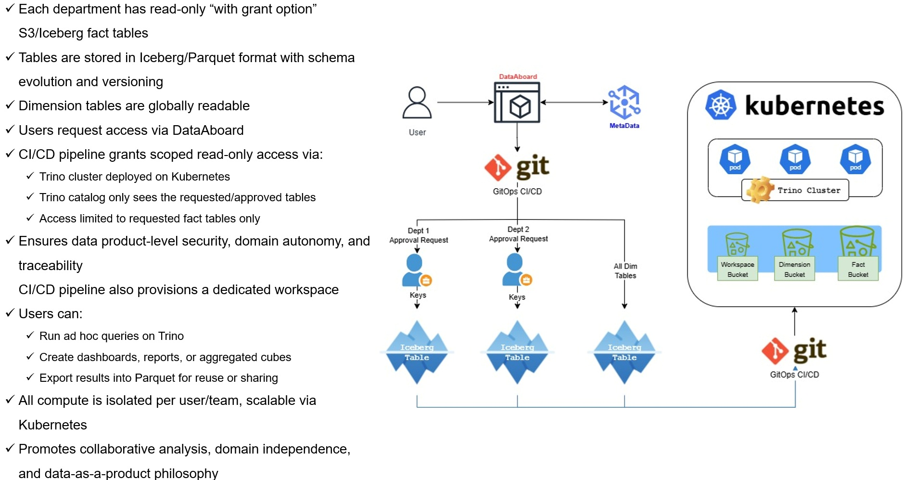

# DataAboard – The First Open-Source Hybrid Data Platform for Humans and LLM Agents

## Self-Service, On-Prem + Cloud Data Mesh / Democratization Platform

Empowering everyone — from analysts, engineers, and scientists to business users and autonomous agents — to securely discover, access, and model data without IT tickets, data exports, or vendor lock-in.

We believe data creators and domain experts — human or machine — know their data best and should be able to act on it without friction.

Our goal is not just to remove barriers between people and their data, but to eliminate obstacles for **intelligent agents** as well. With Version 2, DataAboard becomes the first open-source platform built natively for **hybrid collaboration** between humans and LLM agents — featuring shared workspaces, secure semantic access, and coordinated task execution.

---

## Vision

In today's data-driven world, organizations are bottlenecked by centralized access and compute provisioning — especially in on-premise or hybrid-regulated environments. DataAboard's vision is to enable:

* **Self-service dataset discovery and access** via a unified portal
* **Governed SQL/ML workspaces** that launch on demand
* **Fine-grained access policies** enforced at the data layer
* **Full on-premise operation**, with future cloud connector support
* **Zero vendor lock-in**, open standards, community extensibility

### Hybrid Extension:
As intelligent agents take on structured tasks (e.g., reporting, summarization, anomaly detection), they face the **same data friction** humans do. DataAboard embraces this shift — providing LLM agents with identity, access control, traceability, scheduling, and collaborative workspaces from the ground up.

---

## The Problem DataAboard Solves

Most organizations still rely on centralized IT for access, analytics infra, and ML provisioning:

* **Delays:** Data access and workspace requests via ticketing
* **Limited Exploration:** Friction blocks ad-hoc and agile work
* **Lock-In:** Vendor-specific stacks that exclude on-prem users
* **Governance Gaps:** Inconsistent access across tools and teams

### New Reality:
Soon, departments will run LLM agents at scale. Without coordination, they’ll:
* Query the same data repeatedly
* Operate on stale snapshots
* Drift from team expectations

DataAboard is designed to solve this — proactively — with **coordinated agent access**, **data freshness visibility**, and **shared execution memory** across teams.

---

## The DataAboard Philosophy: "Connectors + Simplicity + No Headache"

Inspired by projects like Airbyte, DataAboard focuses on abstracting complexity through modular components and a frictionless experience:

* **No Reinventing Engines:** We orchestrate Trino, OpenMetadata, Iceberg — not rewrite them.
* **Connector-First:** Use community-maintained connectors from Trino/OpenMetadata for max compatibility.
* **Simple for Users & Agents:** Intuitive UI and GraphQL for humans and agents alike.
* **No Operational Burden:** GitOps + Kubernetes = repeatable, auditable, scalable.

---

## Federated Access & Workspace Provisioning

  
   
  <em>MVP-Figure: GitOps-based access control using Iceberg, Trino, and Kubernetes</em>

---

## Architecture Overview (Hybrid-Enabled)

DataAboard orchestrates intelligent, secure access and compute across both human and agent users, using:

* **FastAPI Backend:** Core API for authentication, workspace orchestration, and governance flows.
* **JWT + LDAP + Entra ID:** Unified auth. Agents and humans receive scoped JWTs.
* **GraphQL Gateway:** Primary interface for LLM agents. Supports fine-grained, introspectable queries.
* **Agent Scheduler:** Coordinates agent execution windows (e.g., every 30 mins) to reduce load and ensure consistency.
* **Semantic Fingerprinting:** Logs every agent query (with agent_id, workflow_id, hash, timestamp) to enable reuse and traceability.
* **Shared Workspaces:** Department-level collaboration spaces for dashboards, notebooks, scheduled jobs, agent logs.
* **OpenMetadata:** Metadata catalog and lineage source of truth.
* **Trino:** Federated SQL layer for cross-source queries and access control enforcement.
* **Kubernetes:** All compute (Trino, JupyterHub, agents) runs in isolated pods.
* **MinIO / Ceph / HDFS:** S3-compatible storage for open formats (Iceberg, Delta, Hudi).
* **GitOps CI/CD:** Git-based access provisioning and workspace lifecycle automation.

---

## Key Features

* **Web UI + GraphQL API:** UI for humans, GraphQL for LLM agents.
* **Hybrid Workspaces:** Shared spaces for human + agent collaboration on governed data.
* **Agent Fingerprinting & Logs:** All agent tasks are logged, explainable, and reusable.
* **Scheduled Agent Tasks:** Coordinated refresh cycles to ensure freshness and avoid redundant queries.
* **Secure & Granular Access:** Trino policies + scoped JWTs ensure least-privilege access.
* **Federated Querying:** Cross-source data via Trino, governed by OpenMetadata.
* **ML + Analytics Workspaces:** Isolated Trino and Jupyter environments per user/team.
* **Kubernetes-Native:** Scalable, portable, and infrastructure-neutral.

---

## Federated Data Ownership & Access Control (Design Principles)

* **Departmental Autonomy:** Domains own their data lake buckets and fact tables.
* **Apache Iceberg Format:** Enables versioning, schema evolution, and ACID.
* **Shared Dimensions:** Dimension tables readable across teams.
* **GitOps-Based Access:** Data access is provisioned by Git branch merge.
* **Traceable by Default:** All access and compute actions logged.
* **Agent + Human Ready:** Every design decision supports both usage models.

---

## Self-Service Compute & Analytics Workspace

* **On-Demand Provisioning:** GitOps triggers Trino/ML workspace creation.
* **Per-Team/Per-User Isolation:** Each team runs in its own environment.
* **Ad-Hoc SQL + ML:** Trino and Jupyter support direct, governed access.
* **Export & Share:** Save output as Parquet for reuse.
* **Hybrid Execution:** Agents can operate in workspaces, share outputs, or sync via the scheduler.

---

## Hybrid Intelligence Roadmap

The future is hybrid. DataAboard already supports:

* **Agent Identity + Scoped Access**
* **Explainable Query Logs + Fingerprints**
* **Shared Workspaces Between Humans & Agents**
* **Scheduled Execution to Avoid Duplication**

We're building toward:

* **Semantic Memory APIs** for agents
* **Self-tuning agent workflows**
* **Agent feedback loops via UI**

---

## Project Status

This project is actively being developed in the open, targeting a **robust MVP launch within approximately one year**.

* FastAPI backend scaffold: **In Progress**
* JWT + LDAP + Agent ID support: **In Progress**
* Trino catalog control: **Designed**
* JupyterHub setup: **Designed**
* GitLab-based CI/CD: **Designed**
* OpenMetadata integration: **Designed**
* GraphQL + Fingerprinting + Scheduler: **Planned**
* Core Kubernetes deployment: **In Progress**

---

## Contribute or Follow

We welcome:

* **Contributions:** Code, docs, testing, bug reports.
* **Feedback:** Especially from hybrid orgs or agent-led teams.
* **Early Pilots:** Looking for teams deploying on-prem and hybrid LLMs.

---

## Contact & Updates

Reach out via GitHub Discussions. Discord and open roadmap portal coming soon.

This README will evolve with each module — just like the platform itself.
